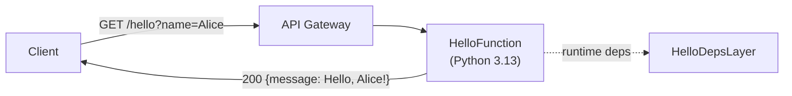

# python-aws-monorepo-boilerplate

> Python 3.13 monorepo boilerplate for serverless AWS applications — powered by uv workspaces, Ruff linting, and AWS CDK.

[](https://github.com/klemjul/python-aws-monorepo-boilerplate/actions/workflows/ci.yml)

---

## Tech Stack

| Tool | Role |
|------|------|
| Python 3.13 | Language |
| [uv](https://docs.astral.sh/uv/) | Package manager & workspace manager |
| [Ruff](https://docs.astral.sh/ruff/) | Linter & formatter |
| [pytest](https://docs.pytest.org/en/stable/) | Test framework |
| [mypy](https://mypy-lang.org/) | Static type checker |
| [AWS CDK (Python)](https://docs.aws.amazon.com/cdk/v2/guide/home.html) | Infrastructure as Code |

---

## Repository Structure

```
python-aws-monorepo-boilerplate/
├── .github/workflows/ci.yml   # CI: lint, type-check, test, CDK synth
├── packages/shared/            # Internal shared library (imported by lambdas)
├── lambdas/hello/              # Example Lambda function (API Gateway → Lambda)
├── infra/                      # AWS CDK app (stacks, bundling)
├── pyproject.toml              # Root uv workspace, dev tools, and mypy config
└── ruff.toml                   # Ruff lint + format config
```

---

## Getting Started

### Prerequisites

| Tool | Installation |
|------|-------------|
| **uv** | See [uv installation docs](https://docs.astral.sh/uv/getting-started/installation/) |
| **Node.js** (≥20 LTS) | See [nodejs.org](https://nodejs.org/) |
| **AWS CDK CLI** (≥2) | See [aws/aws-cdk](https://github.com/aws/aws-cdk) |
| **AWS CLI** | Required for `cdk deploy`. See [AWS CLI installation](https://docs.aws.amazon.com/cli/latest/userguide/getting-started-install.html) (not needed for `cdk synth`) |

### Setup

```bash
uv python install 3.13
uv sync --all-packages
```

---

## Development

### Linting

```bash
uv run ruff check .
```

### Formatting

```bash
# Check only
uv run ruff format --check .

# Auto-fix
uv run ruff format .
```

### Type Checking

```bash
uv run mypy packages/ lambdas/ infra/
```

### Running Tests

```bash
# Run all tests
uv run pytest

# Run with coverage
uv run pytest --cov --cov-report=term-missing

# Run tests for a specific package
uv run pytest packages/shared/tests/
uv run pytest lambdas/hello/tests/
```

---

## CDK Infrastructure

### Synthesise CloudFormation Template

No AWS credentials are needed for synth:

```bash
uv run --directory infra cdk synth
```

### Bootstrap AWS Environment (first-time only)

```bash
uv run --directory infra cdk bootstrap
```

### Deploy to AWS

```bash
uv run --directory infra cdk deploy
```

### Destroy Stack

```bash
uv run --directory infra cdk destroy
```

---

## Architecture



---

## Adding a New Project

**New shared library** (`packages/<name>`):

1. Create the package directory with a `src/` layout and a `pyproject.toml`.
2. The root workspace glob `packages/*` picks it up — run `uv lock` to update the lockfile.
3. Declare it as a workspace dependency in any lambda that needs it via `[tool.uv.sources]`.
4. Append `packages/<name>/src` to `mypy_path` in the root `pyproject.toml` `[tool.mypy]` section.

**New Lambda** (`lambdas/<name>`):

1. Create the package directory with a `src/` layout and a `pyproject.toml`.
2. The root workspace glob `lambdas/*` picks it up — run `uv lock` to update the lockfile.
3. Add a CDK stack in `infra/infra/stacks/` (copy `hello_stack.py` as a starting point) and register it in `infra/app.py`.
4. Append `lambdas/<name>/src` to `mypy_path` in the root `pyproject.toml` `[tool.mypy]` section.
5. Append `lambdas/<name>/tests` to `testpaths` in the root `pyproject.toml` `[tool.pytest.ini_options]` section and to `python.testing.pytestArgs` in `.vscode/settings.json`.

---

## License

[MIT](LICENSE)
